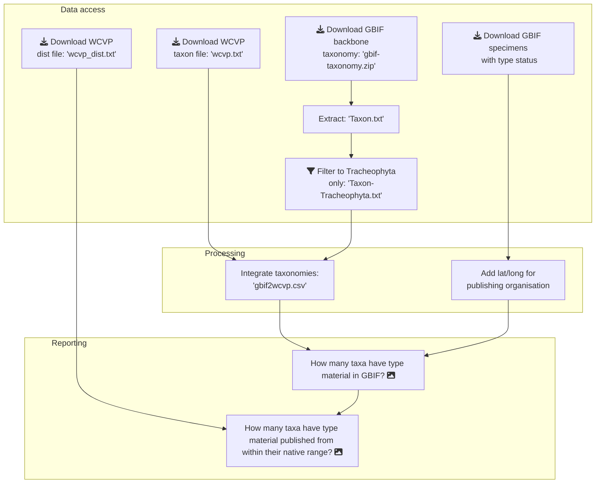

# wcvp-gbif-processing
Match GBIF and WCVP taxonomies, such that an assessment of GBIF holdings can be made using the WCVP taxonomy.

## Research questions

1. How many WCVP taxa have type material in GBIF?
1. How many WCVP taxa have type material held in their WCVP defined native range?

## Overview

## Background

The GBIF taxonomy is available as a download, and the WCVP taxonomy has been made available to authors invited for the special issue.

This integration process has been adapted from one coded in R by [Barnaby Walker](https://www.github.com/barnabywalker). This is available in [DarkSpots/wcvp-gbif-processing](https://github.com/DarkSpots/wcvp-gbif-processing) and for convenience / comparison the R scripts have been copied to the `resources` directory in this repository.

## How to use this repository

### Pre-requisites

The software is written in `Python` and execution is managed with the build tool `make`.

Software package dependencies are specified in `requirements.txt`

### How to set up the environment

1. Create a virtual environment: `python -m venv env`
2. Activate the virtual environment: `source env/Scripts/activate`
3. Install dependencies: `pip install -r requirements.txt`

**Note**: `geopandas` can be tricky to install on Windows, [NN](https://github.com/nickynicolson) has run the analysis process on the Microsoft Planetary Computer (MPC) to avoid installation issues. Unfortunately the environment exposed by the terminal in the MPC does not have the tool `make`. A [github issue](https://github.com/microsoft/PlanetaryComputer/issues/89) has been logged to request this, and includes a work-around to temporarily install make using `mamba install -y -c conda-forge make`. The commands managed by the Makefile also require the command line tool `jq`, similarly this can be installed on the MPC using `mamba install -y -c conda-forge jq`

### Seeing what will be done for each step

A report of the actions that will be taken to build a particular Makefile target can be seen by using the `--dry-run` flag. For example to see the actions taken to process the `gbif2wcvp` target use `make gbif2wcvp --dry-run`.

### How to run the analysis

A complete run can be initiated with `make all` or individual steps are detailed below.

1. Downloads
    - GBIF taxonomy - `make downloads/gbif-taxonomy.zip` or shorthand: `make getgbif`
    - WCVP taxonomy - `make downloads/wcvp.txt` or shorthand: `make getwcvp`
    - WCVP distribution - `make downloads/wcvp_dist.txt`
    - GBIF occurrences in Tracheophyta with type status set - `make data/gbif-types.zip`
    - TDWG WGSRPD L3 regions as geojson - `make downloads/tdwg_wgsrpd_l3.json`
    - (Shorthand target to do all downloads: `make dl`)
1. Extract Taxon.tsv file from GBIF backbone taxonomy:
    - `make data/Taxon.tsv`
1. Filter GBIF taxonomy
    - **Script** `filtergbif.py`
    - **Inputfile(s):** `data/Taxon.tsv`
    - **Outputfile:** `data/Taxon-Tracheophyta.tsv`
    - **Method** TBC
    - **How to run:** Use the Makefile target: `make data/Taxon-Tracheophyta.tsv` or the shorthand: `make filter`
1. Process GBIF taxonomy - integrate with WCVP
    - **Script** `gbif2wcvp.py`
    - **Inputfile(s):** `data/Taxon-Tracheophyta.tsv`, `downloads/wcvp.txt`
    - **Outputfile:** `data/gbif2wcvp.csv`
    - **Method** TBC
    - **How to run:** Use the Makefile target: `make data/gbif2wcvp.csv` or the shorthand: `make all`
1. Process GBIF type data to add details of publishing organisation:
    - **Script** `types2publisherlocations.py`
    - **Inputfile(s):** `data/gbif-types.zip`
    - **Outputfile:** `data/gbif-typesloc.zip`
    - **Method** TBC
    - **How to run:** Use the Makefile target: `make data/gbif-typesloc.zip`
1. Analyse how many taxa have type material in GBIF
    - **Script** `taxa2gbiftypeavailability.py`
    - **Inputfile(s):** `data/gbif2wcvp.csv data/gbif-types.zip`
    - **Outputfile(s):** `data/taxa2gbiftypeavailability.csv data/taxa2gbiftypeavailability.md`
    - **Method** TBC
    - **How to run:** Use the Makefile target: `make data/taxa2gbiftypeavailability.md`
1. Analyse how many taxa have type material published from within native range
    - **Script** `taxa2nativerangetypeavailability.py`
    - **Inputfile(s):** `data/gbif2wcvp.csv downloads/wcvp_dist.txt data/gbif-types.zip data/gbif-typesloc.zip downloads/tdwg_wgsrpd_l3.json`
    - **Outputfile(s):** `data/taxa2nativerangetypeavailability.csv data/taxa2nativerangetypeavailability.md`
    - **Method** TBC
    - **How to run:** Use the Makefile target: `make data/taxa2nativerangetypeavailability.md`

### Cleaning up downloaded and processed files

Two utility make targets are provided for this:

- `make clean` -  removes all processed files (ie the contents of the `data` directory)
- `make sterilise` - removes all processed files *and* all downloaded files (ie the contents of both the `data` and `downloads` directories)

### How to archive an analysis, suitable for reference in an article

1. Execute an complete analysis using `make all`
1. Archive the inputs and results using `make archive`
1. Tag (and comment) the software version used using git tag, and push the tag to github. E.g:
    - `git tag -a v0.0.1 -m "Initial release"`
    - `git push origin v0.0.1`
1. Create a release in github using the tag created in the previous step and attach the archived file created in step 1 to the github release

## Contributing

### Reporting bugs and feature requests

Please use the [github issue tracker](https://github.com/OA-WCVP/wcvp-gbif-processing/issues) associated with this project to report bugs and make feature requests.

### Commit messages

Please link your commit message to an issue which describes what is being implemented or fixed.

### Environment updates

Any new dependencies should be added to `requirements.txt` and committed to git. The `env` directory is specified in `.gitignore`, please do not commit this to git.

### Outputs (data files and chart images)

The `data` and `download` directories are specified in `.gitignore`, so please do not commit these, or any outputs such as data files / chart images to git. Instead you should:

1. Develop a script which automates the construction of the output (the datafile or chart image)
2. Add a target to the `Makefile` which will: 
    - Define the dependencies of the output (the script used to create the output, and any input files required)
    - Call the script and generate the output
3. Update the instructions above

Similarly, the `archive` directory is specified in `.gitignore`, please do not commit this or any of its contents to git - instead follow the process laid out in the "How to archive an analysis" section above.

## Contact information

[Nicky Nicolson](https://github.com/nickynicolson), RBG Kew (n.nicolson@kew.org)
